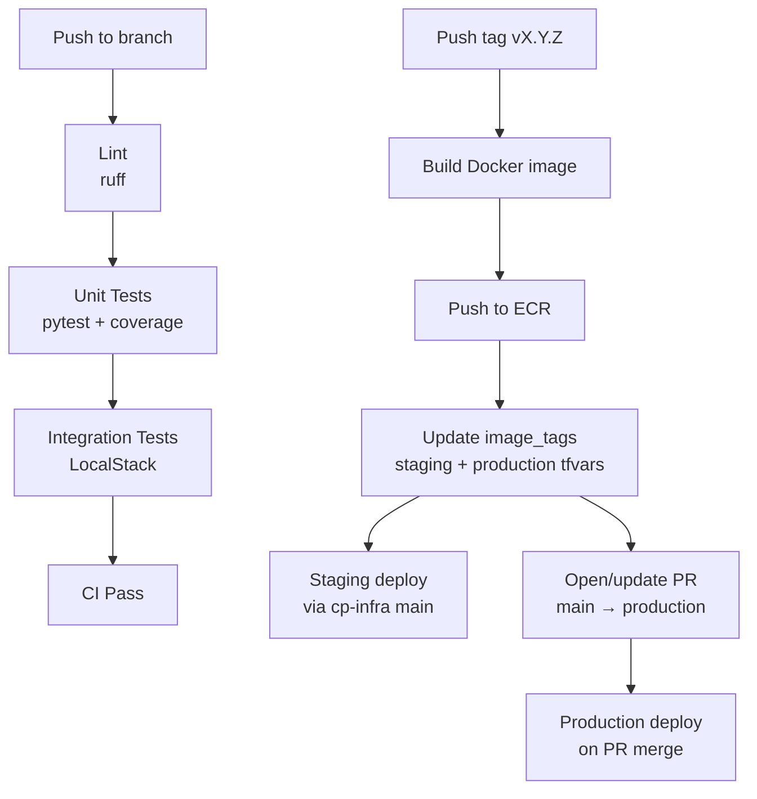

# cp-api


REST API microservice — receives email messages over HTTP, validates a bearer token against AWS SSM Parameter Store, and publishes the payload to SQS.

---

## Architecture


---

## Endpoints

| Method | Path | Auth | Description |
|--------|------|------|-------------|
| `GET` | `/healthz` | None | ALB health check |
| `POST` | `/message` | Token in body | Validate + publish to SQS |

### POST /message

**Request**
```json
{
  "data": {
    "email_subject": "Happy new year!",
    "email_sender": "John Doe",
    "email_timestream": "1693561101",
    "email_content": "Just want to say... Happy new year!!!"
  },
  "token": "<secret>"
}
```

**Responses**

| Status | Meaning |
|--------|---------|
| `200` | Message published to SQS |
| `401` | Invalid token |
| `422` | Missing or malformed fields |
| `503` | SSM or SQS unavailable |

---

## CI/CD



- **CI** runs on every push — lint, unit tests, integration tests against LocalStack
- **Release** triggers on `v*.*.*` tag push — builds image, pushes to ECR, updates `cp-infra` tfvars, opens production PR

---

## Local development

```bash
# Install dependencies
python -m venv .venv && source .venv/bin/activate
pip install -r requirements.txt -r requirements-dev.txt

# Run unit tests
make test-unit

# Run integration tests (requires LocalStack)
cd ../cp-infra && make local-up
LOCALSTACK_ENDPOINT=http://localhost:4566 make test-integration

# Run the API locally
uvicorn app.main:app --reload
```

---

## Environment variables

| Variable | Default | Description |
|----------|---------|-------------|
| `AWS_REGION` | `us-east-2` | AWS region |
| `SQS_QUEUE_URL` | — | SQS queue URL |
| `SSM_PARAMETER_NAME` | `/devops-exam-costa/api/token` | SSM path for API token |
| `LOCALSTACK_ENDPOINT` | — | Set to use LocalStack instead of AWS |
| `LOG_LEVEL` | `INFO` | Log level |
| `APP_VERSION` | `unknown` | Injected at build time via `--build-arg VERSION` |

---

## Deploying a specific tag

```bash
# Trigger release workflow for an existing tag
gh workflow run release.yml \
  --repo koss110/cp-api \
  --field image_tag=v1.0.1 \
  --field open_pr=true
```
