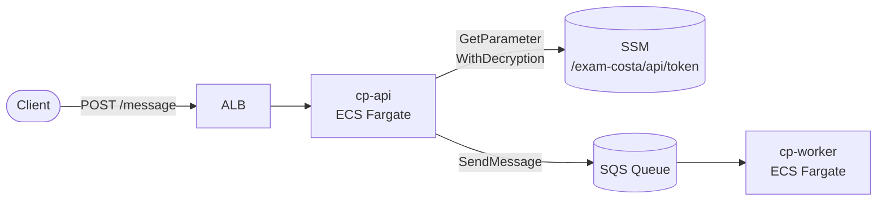
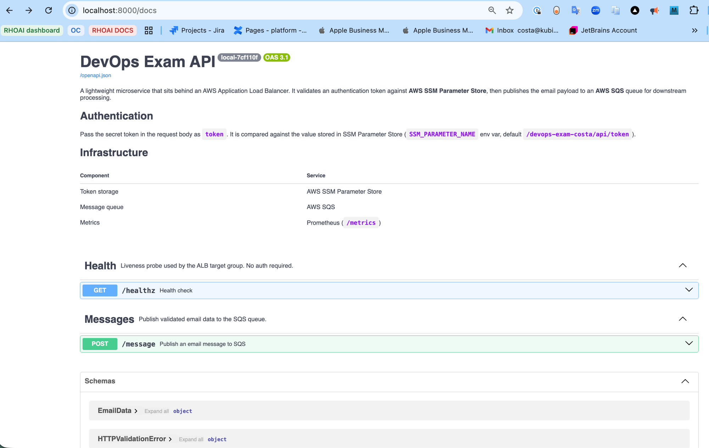
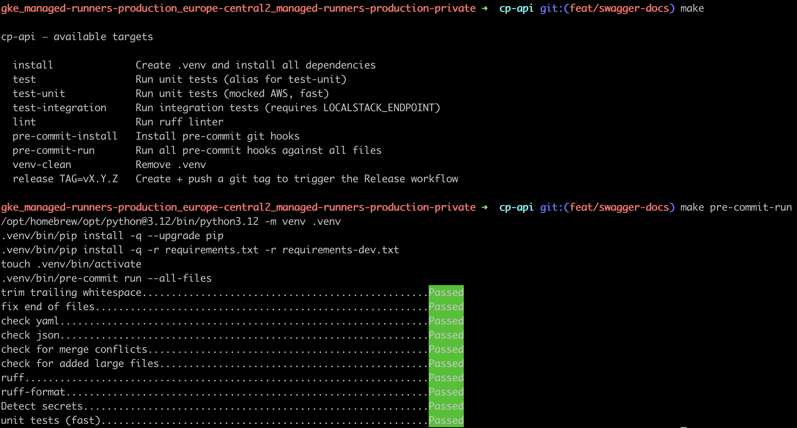
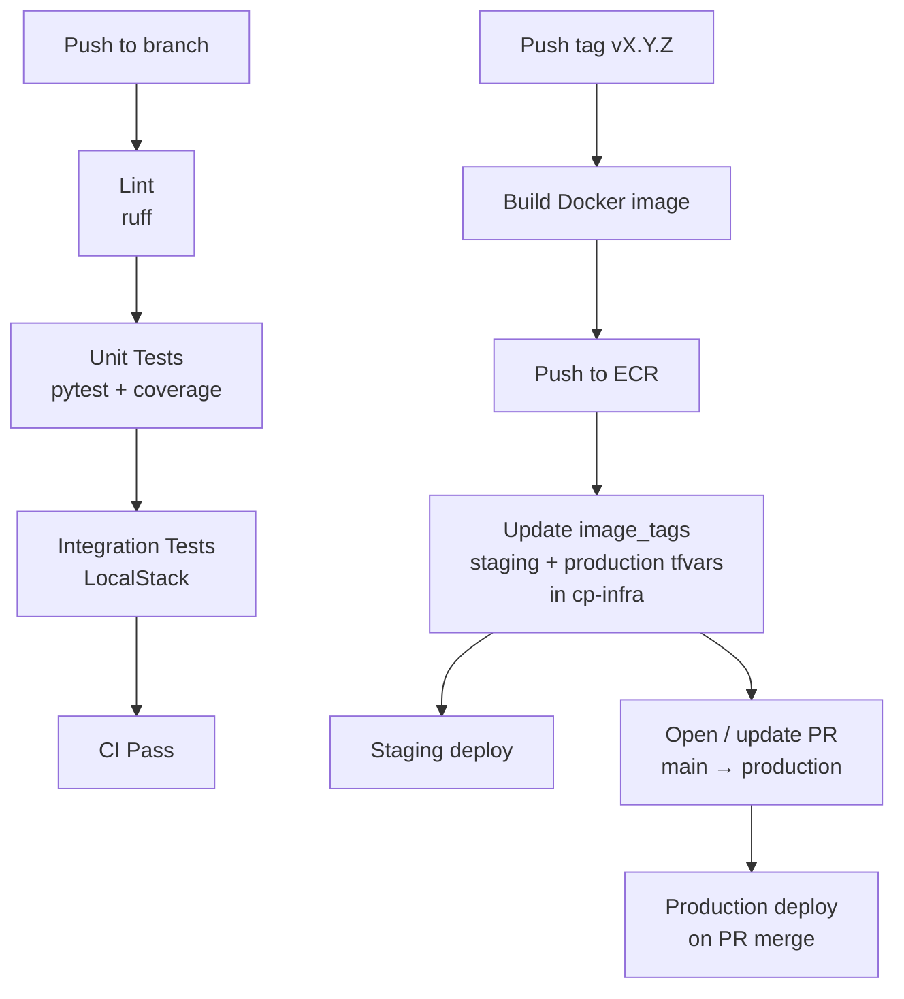

# cp-api


REST API microservice — receives email messages over HTTP, validates a bearer token against AWS SSM Parameter Store, and publishes the payload to SQS.

> Infrastructure, local stack, and CI/CD orchestration live in [`cp-infra`](https://github.com/koss110/cp-infra).

---

## Architecture



---

## Swagger UI

Interactive API docs available at [`/docs`](http://localhost:8000/docs) when running locally.




---

## Endpoints

| Method | Path | Auth | Description |
|--------|------|------|-------------|
| `GET` | `/healthz` | None | ALB health check |
| `POST` | `/message` | Token in body | Validate + publish to SQS |

### POST /message

**Request**
```json
{
  "data": {
    "email_subject": "Happy new year!",
    "email_sender": "John Doe",
    "email_timestream": "1693561101",
    "email_content": "Just want to say... Happy new year!!!"
  },
  "token": "<secret>"
}
```

**Responses**

| Status | Meaning |
|--------|---------|
| `200` | Message published to SQS |
| `401` | Invalid token |
| `422` | Missing or malformed fields |
| `503` | SSM or SQS unavailable |

---

## Local development

The full local stack (LocalStack + cp-api + cp-worker) is managed from [`cp-infra`](https://github.com/koss110/cp-infra). Clone all three repos as siblings:

```
parent-dir/
├── cp-infra/
├── cp-api/      ← this repo
└── cp-worker/
```

```bash
cd cp-infra

# Start LocalStack and seed AWS resources
make local-up

# Build images and start the full stack
make local-build

# Test the API
curl http://localhost:8000/healthz

curl -s -X POST http://localhost:8000/message \
  -H "Content-Type: application/json" \
  -d '{
    "data": {
      "email_subject": "Happy new year!",
      "email_sender": "John Doe",
      "email_timestream": "1693561101",
      "email_content": "Just want to say... Happy new year!!!"
    },
    "token": "local-dev-token"
  }'

# Follow logs
make logs-api

# Tear down
make local-down
```

---

## Make targets

| Target | Description |
|--------|-------------|
| `make install` | Create `.venv` and install all dependencies |
| `make test` | Run unit tests (alias for `test-unit`) |
| `make test-unit` | Unit tests with mocked AWS — fast, no dependencies |
| `make test-integration` | Integration tests against LocalStack — requires `LOCALSTACK_ENDPOINT` |
| `make lint` | Run ruff linter |
| `make pre-commit-install` | Install pre-commit git hooks |
| `make pre-commit-run` | Run all pre-commit hooks against all files |
| `make venv-clean` | Remove `.venv` |

### Running integration tests

```bash
# Start LocalStack first (from cp-infra)
cd ../cp-infra && make local-up

# Then run
cd ../cp-api
LOCALSTACK_ENDPOINT=http://localhost:4566 make test-integration
```

---

## Pre-commit hooks

Runs on every commit in this repo:

| Hook | What it checks |
|------|---------------|
| `trailing-whitespace` | No trailing whitespace |
| `end-of-file-fixer` | Files end with a newline |
| `check-yaml` | Valid YAML syntax |
| `check-merge-conflict` | No leftover conflict markers |
| `check-added-large-files` | No files > 500 KB |
| `ruff` | Python lint |
| `ruff-format` | Python formatting |
| `detect-secrets` | No hardcoded credentials |
| `unit tests (fast)` | Unit tests run on every Python file commit |

**Setup:**
```bash
make pre-commit-install
```

**Run manually:**
```bash
make pre-commit-run
```



---

## CI/CD



### Deploying a specific tag

```bash
# Via GitHub CLI — redeploy an existing tag without rebuilding
gh workflow run release.yml \
  --repo koss110/cp-api \
  --field image_tag=v1.0.1 \
  --field open_pr=true
```

---

## Environment variables

| Variable | Default | Description |
|----------|---------|-------------|
| `AWS_REGION` | `us-east-2` | AWS region |
| `SQS_QUEUE_URL` | — | SQS queue URL |
| `SSM_PARAMETER_NAME` | `/exam-costa/staging/api/token` | SSM path for API token — pattern `/{project}/{env}/api/token` |
| `LOCALSTACK_ENDPOINT` | — | Set to use LocalStack instead of AWS |
| `LOG_LEVEL` | `INFO` | Log level |
| `APP_VERSION` | `unknown` | Injected at build time via `--build-arg VERSION` |
